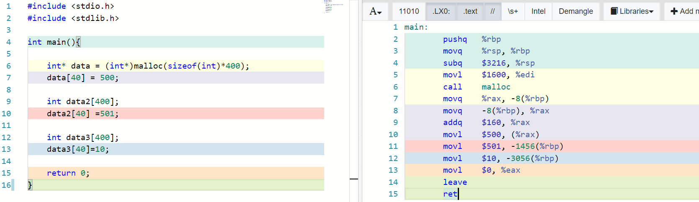

# x86-64 Assembly 

> "Nearing Machine Code Representation"

## Introduction/Motivation

Not so long ago (in a galaxy not so far away), programmers wrote most of their code in assembly. While programmers today primarily use higher level languages (Python, C, etc), it is not uncommon to debug the assembly of your code. These higher level languages afterall typically translate down to an assemble or assembly-like language. 

If you are interested in cybersecurity and reverse engineering, folks more frequently write and analyze assembly code. For high performance applications like [games](https://www.gamasutra.com/view/news/169946/CC_low_level_curriculum_Looking_at_optimized_assembly.php), programmers may write very optimized code using assembly to get things *just* right. If you are working in hardware or an embededd device, you might also do some assembly programming, as other languages environments are too bulky to support on a small device. Even web developers are using something called 'webassembly'. Hmm, the list is getting long here--I think the point is that learning assembly has quite some relevance! Let's dig in and get some practice.

In today's lab you are going to get some practice looking at assembly.

# Part 0 - Godbolt

I **strongly** recommend using the godbolt tool (https://godbolt.org/) to write and experiment with your C programs for this exercise.  The color mappings will help you see what is going on with the generated assembly. You **should** try using both godbolt and your compiler to generate assembly.

Here is an example of the Godbolt tool (and also shows part 4 of this lab)

# Part 1- Compiler Generated Assembly

Let us get some experience reading assembly code generated by the compiler (or godbolt)! It is actually kind of fun, you may learn some new instructions, and at the very least gain some intuition for what code the compiler is generating.

## Compiler generated assembly 1 - Swap

- Write a C program that swaps two integers(in the main body of code).
  - Save, Compile, and Run the program to verify it works.
- Output the assembly from that program (Save it as swap_int.s).
  - Use: `gcc -O0 -fno-builtin swap_int.c -S -o swap_int.s`
- Now modify your program to swap two long's.
  - Save, Compile, and Run the program to verify it works.
- Output the assembly from that program (Save it as swap_long.s).
  - Use: `gcc -O0 -fno-builtin swap_long.c -S -o swap_long.s`
- Compare each of the two assembly files using diff. See what changed.
- diff syntax
  - Use: `diff -y swap_int.s swap_long.s`
  
### Response/Observations

- The numbers pointed to by the rbp/rsp registers take a different amount of space so for instance
$10, -4(%rbp) versus $10, -8(%rbp) when 10 is stored as int vs long.

-Int program uses eax whereas long program uses rax to store /dereference the numbers.
eax is an int size register and rax is a long size register (64 bit).

-EAX/RAX initially stores 10 and 20  and later the temp variable at -12(%rbp) for int and at  -24(%rbp) for long stores 10 to prepare for a swap. EAX/RAX dereference rbp for whichever number they need. Then the rbp can swap for instance
 %eax, -8(%rbp) would make the value of 20 at address -8(%rbp)instead be what  is stored at the eax register.

## Compiler generated assembly 2 - Functions

- Write a C program that swaps two integers in a **function** (You may use today's slide as a reference)
  - Save, Compile, and Run the program to verify it works.
- Output the assembly from that program (Save it as swap.s).
  - Use: `gcc -O0 -fno-builtin  swap.c -S -o swap.s`
- Do the instructions use memory/registers in a different way?

### Response/Observations

-rsp is moved to rpb that way the program can return to main and when adjustments are made to rsp rbp can access from an offset.

- in main, 10 and 20 are moved to rsi and rdi via several steps (after going to rpb and then tax/rdx) then the fn is called.

-In the function itself, rdi and rsi (first and second arguments) are moved to rbp. So rbp has 10 and 20 initially in the swap fn. 

- It looks like RAX is then set to the rbp that has value 10 from the RDI and RDX is set to the rbp with value 20 from the RSI. Then %rdx, (%rax) ( same as *a = t1;) swaps those so when we print *a it will have value of b since *a = t1 = *b.

## Compiler generated assembly 3 - Static Array
- Write a C program called array.c that has an array of 400 integers in the function of main.
  - Initialize some of the values to something (do not use a loop) (e.g. myArray[0]=72; myArray[70]=56; etc)
  	- Note that it is helpful to use 'weird' numbers so you can see where they jump out.
  - Save, Compile, and Run the program to verify it works.
- Output the assembly from that program (Save it as array.s).
  - Use: `gcc -O0 -fno-builtin  array.c -S -o array.s`
- How much are the offsets from the address?

### Response/Observations

The address offset is four per 1 index. array[400] has 0 offset (its at address 0x0) and array[0] is at -1600.

## Compiler generated assembly 4 - Dynamic Array 

- Write a C program called array2.c that has an array of 400 integers in the function of main that is dynamically allocated.
  - Initialize some of the values to something (do not use a loop) (e.g. myArray[66]=712; myArray[70]=536; etc)
  - Save, Compile, and Run the program to verify it works.
- Output the assembly from that program (Save it as array2.s).
  - Use: `gcc -O0 -fno-builtin  array2.c -S -o array2.s`
- Study the assembly and think about what is different from the static array.

### Response/Observations

The offset on rpb is always -8( to store a pointer) so it keeps getting overwriten, unlike with the static array.
The byte amount is addq to rax as an actual $ value and the value at the index is moved to rax also as a $ value. For instance, array[1] would lead to addq $4, %rax. This is unlike the other array in that here the address offsets are all being addq as $.

Also, Malloc is called in the assembly code.

## Compiler generated assembly 5 - Goto
The C programming language has a 'goto' command, search how to use it if you have not previously.

- Write a C program using the goto command and a label.
  - Save, Compile, and Run the program to verify it works.
- Output the assembly from that program (Save it as goto.s).
  - Use: `gcc -O0 -fno-builtin  goto.c -S -o goto.s`
- Observe what kind of jmp statement is inserted.

### Response/Observations

There is a statement jmp .L2 (this is equivalent to goto label). L2 is where the label begins.
As a side note the counter keeps adding 1 to -4(%rpb) which starts as 1 (its variable n).

## Compiler generated assembly 6 - For-loops
- Write a C program using a for-loop that counts to 5.
  - Save, Compile, and Run the program to verify it works.
- Output the assembly from that program (Save it as for.s).
  - Use: `gcc -O0 -fno-builtin  for.c -S -o for.s`
- Observe where the code goes for the condition statement (at the start or at the end?).

### Response/Observations

Im not sure what this question means. “Where it goes for the condition statement”…. The for loop code in assembly for the condition on line 6 is in assembly on Klines 7 and 8 AND 16 through 18.  The printf that occurs as a result of the condition being met is in between the assembly codes for the line with the condition. There is a jmp to .L2. Possibly the jmp doesn’t occur when condition is met.

## Compiler generated assembly 7 - Switch Statements

- Write a C program using a switch statement (Sample here)[https://www.tutorialspoint.com/cprogramming/switch_statement_in_c.htm].
  - Save, Compile, and Run the program to verify it works.
- Output the assembly from that program (Save it as switch.s).
  - Use: `gcc -O0 -fno-builtin switch.c -S -o switch.s`
- See what code a switch statement generates. Is it optimal?

### Response/Observations

I dont know what this question is fishing for. Maybe its referring to that in main the case that will trigger is not jumped to first, which means main was not built optimally (in that main will check other cases first). The order is different from the order I coded in but still not optimal since it still makes other checks. Its optimal in that it creates a jump table but the order isn’t perfect for least amount of jumps.
Everything jumps to the print statement that contains door whreas if you use if / else if  each L…L1,L2,L3 jumps to each other instead.

## Compiler generated assembly 8 - Add Function

- Write a C program that calls an add function(long add(long a, long b).
  - Save, Compile, and Run the program to verify it works.
- Output the assembly from that program (Save it as add.s).
  - Use: `gcc -O0 -fno-builtin add.c -S -o add.s`
- Observe the outputs
- Observe arguments put into registers
- Observe where 'popq' is called.

### Response/Observations

popq %rbp occurs at the end of the add function after dereference c is stored in eax. Edx and eax (which hold the psi and edit parameters value) are added and stored
In eax. Eax seems to store the value of c before pop rbp.

# More resources to help

- Matt Godbolt has written a great tool to help understand assembly generated from the compiler. 
  - https://godbolt.org/
- An assembly cheat sheet from Brown
  - https://cs.brown.edu/courses/cs033/docs/guides/x64_cheatsheet.pdf
- MIT Cheat sheet
  - http://6.035.scripts.mit.edu/sp17/x86-64-architecture-guide.html

# Deliverable

- For part 1, add your .S files that you have generated to this repository.
  - Note this submission will be auto graded for completion (i.e. save the file names as shown).
  - Add your observations in the appropriate response/observations section for each code.

# Going Further

- (Optional) Try the objdump example to read the disassembly from your programs executables. Observe how close the output is to the compiler generated output.
